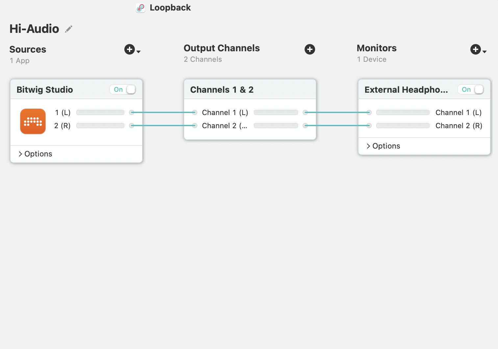
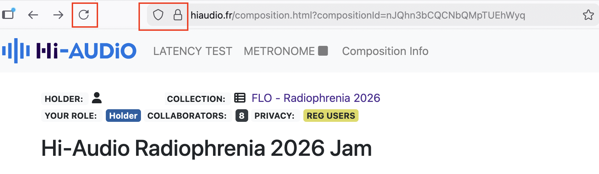
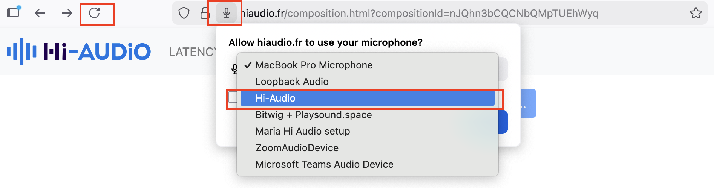
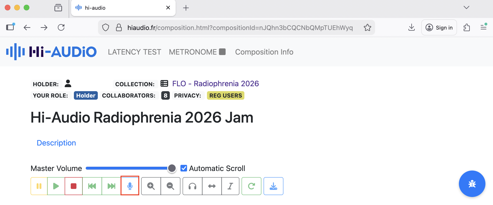
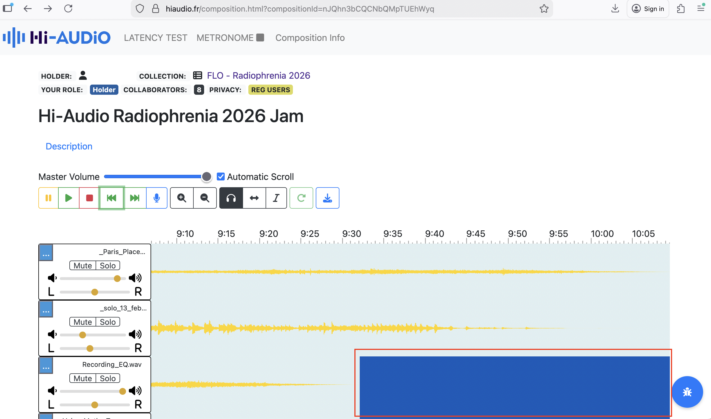
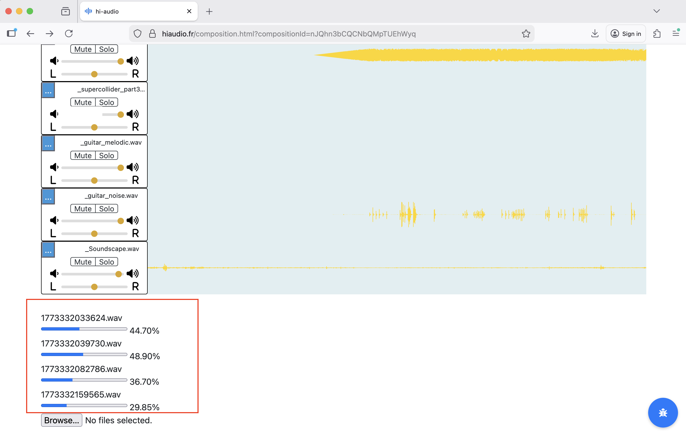
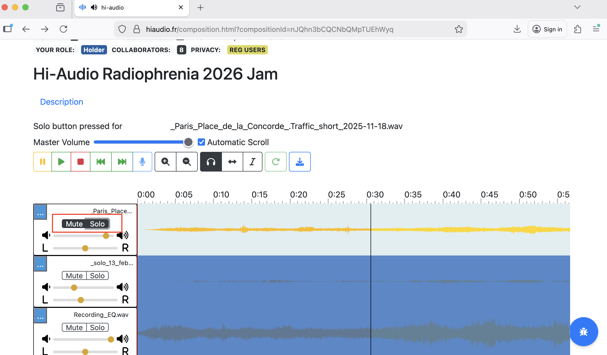
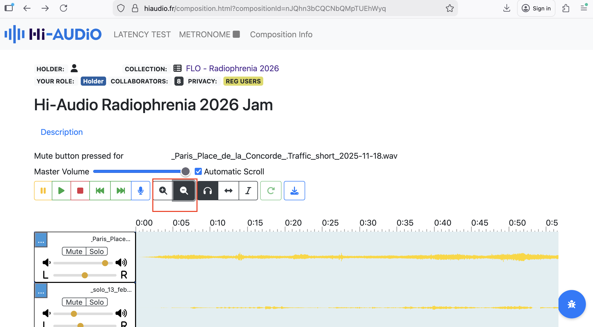

**Project / Platform:** Hi-AUDiO /
[<u>https://hiaudio.fr</u>](https://hiaudio.fr)  
**Client / Lab:** Télécom Paris  
**Evaluator:** Nela Brown

**Role:** Director, FLO Lab

**Evaluation Period:** 13/02/2026 - 13/03/2026  
**Document Date:** 22 March 2026

**Summary**

This memo outlines findings from a practice-based evaluation of the
Hi-AUDiO platform, conducted by nine performers from the Female Laptop
Orchestra (FLO). The evaluation took place between February 13, 2026,
and March 13, 2026, during the production of a collaborative composition
intended for the Radiophrenia 2026 festival broadcast. While the
platform demonstrated strong accessibility and ease of onboarding
through its browser-based design, several workflow limitations were
identified when used in a professional context. The observations
presented below translate participant feedback into design
considerations that may inform future development of the platform.

**1. Purpose of This Memo**

The purpose of this memo is to present findings from a practice-based
expert evaluation of the Hi-AUDiO platform conducted through artistic
use rather than task-based usability testing. The goal of the evaluation
was to assess the platform’s suitability for
real-world creative workflows, identify strengths and limitations and
highlight design considerations relevant to advanced users and artistic
contexts. By synthesising qualitative feedback gathered through the
evaluation process, the memo identifies workflow bottlenecks and
outlines considerations that may inform future platform development and
research dissemination.

**2. Evaluation Context**

**2.1 User Profile**

The evaluation was conducted by nine members of the Female Laptop
Orchestra (FLO), including the FLO Lab director listed above as the
‘Evaluator’. Female Laptop Orchestra (FLO) is an internationally
distributed ensemble that regularly incorporates emerging technologies
into compositions, recordings, and performances. Within this ecosystem,
FLO Lab operates as a practice-based research initiative where new
audiovisual tools are tested and evaluated from both artistic and
technical perspectives.

Most FLO members hold academic positions in music, sound, HCI, and
related fields, along with extensive experience in the use of
professional Digital Audio Workstations (DAWs) and experimental
research-stage Web Audio platforms in Networked Music Performance (NMP).
This positions FLO, and by extension FLO Lab, as a research-literate
group of expert practitioners capable of adapting to diverse creative
and technical workflows without formal training.

**2.2 Use Case**

In this evaluation, the Hi-AUDiO platform was used for remote
asynchronous recording of 16 audio tracks by FLO members based in
Australia, Brazil, Croatia, France, Italy, Poland, Slovakia, Spain and
the UK. The recordings were intended as source material for a
collaborative composition that would later be mixed offline and
submitted to the Radiophrenia 2026 festival.

Individual recording sessions involved the use of acoustic and
electronic instruments, percussion, vocals (utilising audio interfaces
and Loopback software for internal audio routing to Firefox), as well as
live coding and binaural soundscape recordings.

The workflow also involved downloading recordings from the Hi-AUDiO
platform, converting and importing them into performers’ Digital Audio
Workstations (DAWs) for additional DSP processing using audio plug-ins
and AI-based tools. The processed material was subsequently uploaded
back to the platform.

As the resulting composition is intended for broadcast at a professional
music festival, the project also provides a potential dissemination
context for the Hi-AUDiO platform and the associated research project
initiative.

**2.3 Scope**

The evaluation focused on the recording interface, transport controls,
visual feedback, file management, creative flow and suitability for
professional contexts.

**3. Methodological Approach**

Seven FLO members were onboarded to the Hi-AUDiO platform by the Lead
Software Engineer, across two separate two-hour sessions. Two additional
FLO members were onboarded by the FLO Lab director, who also coordinated
the recording process, organised scheduling, assisted with
troubleshooting, and collected participant feedback throughout the
evaluation period. The onboarding sessions introduced the platform
interface, conducted latency tests, and examined signal flow across
different recording configurations.

Following onboarding, the FLO Lab director created a private Collection
titled “*FLO - Radiophrenia 2026” a*nd Composition within that
Collection titled “Hi-Audio Radiophrenia 2026 Jam.”

The remaining eight performers were invited as members using the
Composition Info section, which generated automated email invitations
from the Hi-AUDiO platform. Upon registration, participants were able to
navigate directly to the shared recording session workspace.

All tracks were recorded and uploaded between February 13, 2026, and
March 3, 2026. The mixing phase took place between March 3 and March 13,
2026. A detailed recording timeline is provided in the Appendix.

The FLO Lab evaluation approach prioritises ecological validity. Rather
than relying on controlled usability tasks, the evaluation followed a
practice-based research methodology grounded in real creative activity.
Insights were generated through hands-on use of the platform during
individual recording sessions, reflecting observations during and after
these sessions, and informal comparison with existing tools and
workflows.

Communication between participants took place through a dedicated
WhatsApp group created specifically for the testing period, ensuring
that discussions related to the Hi-AUDiO platform did not overlap with
other FLO projects. WhatsApp was chosen over email to enable rapid
communication and troubleshooting during recording sessions. Issues
encountered by performers were addressed either directly by the FLO Lab
director or communicated to the Lead Software Engineer where necessary.

The collected material included notes taken during onboarding and
recording sessions, informal feedback regarding technical issues
encountered during the creative process (such as signal-flow challenges
or interface inconsistencies), and suggestions for platform improvement.
The following sections summarise the key insights derived from this
material.

**4. Platform Strengths**

This section highlights aspects of the Hi-AUDiO platform that
effectively supported the collaborative workflow used by FLO members
during the evaluation.

**4.1 Accessibility**

The browser-based architecture was identified as a major strength.
Participants noted that the ability to access the recording environment
without installing dedicated software significantly lowers the barrier
to entry for geographically distributed collaborators and supports
cross-platform participation.

**4.2 Ease of Use**

Despite the early-stage nature of the platform, the core recording
interface was described by several FLO members as
*“simple and easy to use”* for basic recording
tasks. This simplicity contributed positively to the onboarding process
and allowed performers to begin recording relatively quickly.

**4.3 Interface Discoverability**

Hover-over labels for interface buttons (e.g., the Stop control) were
noted as helpful in supporting initial orientation within the platform.
These small interface cues helped compensate for the absence of some
familiar DAW conventions.

**4.4 Track Annotation**

The ability to attach notes and annotations to individual tracks
supported communication between geographically distributed performers.
Participants found this feature particularly useful when explaining
recording conditions, signal chains, or artistic intentions associated
with individual contributions.

**5. Observed Workflow Challenges**

This section summarises workflow limitations encountered during the
evaluation. The observations reflect issues that became visible during
real creative use of the platform rather than controlled usability
testing.

**5.1 Visual Feedback and Interface Clarity**

Several interface elements lacked clear state-change indicators, which
occasionally caused uncertainty during recording sessions.

For example, the Mute and Solo buttons did not provide sufficiently
visible confirmation when active. Similarly, the microphone icon used to
initiate recording differed from the conventional
“record” symbol familiar to most Digital Audio
Workstation (DAW) users. Because FLO members were typically recording
through external audio interfaces rather than internal microphones, this
icon initially caused confusion regarding its function.

In addition, the visual change indicating that recording had started was
extremely subtle. In practice, the transport bar appeared slightly
lighter after activation; however, this change was difficult to perceive
on many displays and in many lighting conditions, making it unclear
whether recording had begun.

Some performers also noted that dark-blue waveform segments representing
silence could be mistaken for inactive or missing audio.

**5.2 Transport Controls and Navigation**

Participants reported several missing features commonly found in
professional audio software that affected workflow efficiency.

The absence of standard keyboard shortcuts—most notably the Spacebar for
Play/Stop—was reported as slowing down recording sessions because
performers needed to move the cursor repeatedly between recording areas
and the transport bar.

Fast Forward and Rewind controls also appeared to jump directly to the
beginning or end of the timeline rather than moving incrementally
through the recording. This behaviour differed from typical DAW
navigation patterns.

Zoom controls were described as somewhat unresponsive, and the function
of the headphones icon (Select Cursor) was not immediately clear to some
participants.

**5.3 Recording Workflow Limitations**

Several limitations affected the flexibility of the recording process.

Participants noted the absence of a pause-and-continue recording option,
which would allow performers to temporarily stop recording while
maintaining continuity within a single track. Such functionality is
widely used in iterative recording workflows.

The platform also lacked visible input gain control, which was described
as critical when working with external recording chains.

**5.4 Editing and Audio Manipulation**

Participants identified the absence of basic non-destructive editing
tools as a major limitation.

Common operations such as cutting, trimming, or pasting audio
regions—normally performed through shortcuts such as Cmd/Ctrl+C and
Cmd/Ctrl+V—were not supported. As a result, several editing tasks had to
be deferred to external Digital Audio Workstations during the final
mixing stage.

Similarly, the lack of volume automation or envelope control made it
difficult to manage the dynamic balance between tracks or perform basic
crossfades directly within the platform.

**5.5 Timeline Manipulation**

The “Shift Audio in Time” feature allowed clips
to be repositioned, but participants noted that it was possible to
accidentally move audio backwards on the timeline without clear
safeguards. Once moved, it was difficult to determine whether the audio
had been returned precisely to its original starting position.

**5.6 Signal Flow and Rendering Stability**

Some participants experienced long rendering times and occasional
audio-quality issues when working with complex signal chains.

For example, sessions using internal routing tools such as Loopback
occasionally produced clipping, digital artefacts, or signal-level
drops. These behaviours were particularly noticeable when longer
processing chains were involved.

**5.7 Interaction Design and Gestural Support**

Participants also noted the absence of several common interaction
gestures. For example, pinch-to-zoom functionality was not supported,
which limited the ability to quickly inspect waveform details during
recording sessions.

**5.8 File Interoperability**

The use of .m4a lossy audio formats created friction when exporting
files to professional DAWs for offline processing. Several participants
reported that this required additional conversion steps before further
editing or mixing could take place.

**5.9 Track Management**

Participants also noted that renaming tracks within the interface was
not immediately intuitive, which occasionally slowed down the
organisation of recording sessions.

**6. Design Implications and Opportunities**

The observations outlined below translate
participants’ testing experiences into design
implications that may inform future development of the platform.

| **Area**              | **Observation**                                                                                             | **Impact on Workflow**                                                                               | **Design Opportunity**                                                                                     |
|-----------------------|-------------------------------------------------------------------------------------------------------------|------------------------------------------------------------------------------------------------------|------------------------------------------------------------------------------------------------------------|
| Accessibility         | Browser-based access enabled participants to join recording sessions without installing dedicated software. | Lowered barriers to participation for geographically distributed performers.                         | Maintain browser-first architecture while expanding professional recording features.                       |
| Interface Clarity     | Some interface elements lacked clear state-change indicators (e.g., Mute, Solo, Record).                    | Users were occasionally unsure whether functions were active during recording.                       | Introduce clearer visual feedback (colour change, animation, or active-state highlighting).                |
| Recording Controls    | Recording was initiated via a microphone icon rather than a conventional DAW record symbol.                 | Initial confusion regarding recording status, especially for users working with external interfaces. | Consider adopting industry-standard recording iconography or supplementing with clearer status indicators. |
| Transport Controls    | Standard DAW shortcuts such as Spacebar for Play/Stop were not available.                                   | Slowed down workflow during recording sessions due to repeated cursor navigation.                    | Introduce keyboard shortcuts for commonly used transport functions.                                        |
| Recording Workflow    | No option to pause recording and continue within the same track.                                            | Interrupted iterative recording workflows and required multiple takes.                               | Implement pause/continue recording functionality.                                                          |
| Input Control         | Lack of visible input gain controls within the interface.                                                   | Limited ability to adjust recording levels during sessions.                                          | Introduce basic input level monitoring and gain control tools.                                             |
| Editing Capabilities  | Absence of non-destructive editing tools such as cut, trim, and paste operations.                           | Participants needed to export files to external DAWs for basic editing tasks.                        | Implement lightweight editing tools or improved integration with external DAWs.                            |
| Automation            | No volume envelopes or crossfade functionality.                                                             | Dynamic control and transitions had to be performed during offline mixing.                           | Add basic automation or envelope-based gain control.                                                       |
| Timeline Manipulation | “Shift Audio in Time” allowed accidental misalignment of clips without safeguards.                          | Difficult to reposition clips precisely during recording sessions.                                   | Add snap-to-grid options or timeline alignment markers.                                                    |
| Navigation            | Zoom controls were perceived as slow or unresponsive; pinch-to-zoom gestures not supported.                 | Reduced efficiency when navigating longer recordings.                                                | Improve zoom responsiveness and support gesture-based navigation.                                          |
| Signal Processing     | Complex signal chains occasionally caused rendering delays and audio artefacts.                             | Interrupted creative flow during recording sessions.                                                 | Improve stability when handling longer or more complex audio routing pipelines.                            |
| File Interoperability | Audio files exported in .m4a lossy format.                                                                  | Required conversion before import into professional DAWs.                                            | Offer optional export in lossless formats such as WAV.                                                     |
| Track Management      | Renaming tracks was not immediately intuitive.                                                              | Slowed organisation of multi-track sessions.                                                         | Simplify track naming workflow and improve visibility of track metadata.                                   |
| Collaboration         | Track annotations supported communication between performers.                                               | Improved clarity when sharing recordings across distributed participants.                            | Expand annotation tools for collaborative documentation.                                                   |

**7. Assessment of Platform Fit for Professional Creative Workflows**

In its current iteration, the Hi-AUDiO platform functions primarily as a
lightweight multitrack recording environment rather than a fully
featured creative production system.

The platform’s web-based simplicity is a clear
strength; however, the absence of core editing capabilities (e.g., cut,
trim, paste) and dynamic control tools (e.g., automation envelopes)
limits its suitability for end-to-end professional production workflows.

For the Female Laptop Orchestra (FLO) to adopt Hi-AUDiO as a regular
tool for distributed composition, further development would be required
to support non-linear editing, advanced signal control, and workflow
features aligned with established professional audio practices.

**8. Key Findings and Next Steps**

The collective feedback identifies a gap between the current feature set
and the requirements of professional creative workflows. While usability
and onboarding are promising, several foundational features would
significantly enhance suitability for advanced use.

The most critical areas for development include improved visual feedback
for active states, implementation of standard keyboard shortcuts,
support for uncompressed export formats, and basic non-destructive
editing tools (e.g., cut, trim, and envelope control).

**8.1 Key Findings**

The browser-based architecture significantly lowers barriers for
distributed collaboration.

Insufficient visual state indicators (e.g., mute, solo, record)
occasionally created uncertainty during recording sessions.

Absence of industry-standard shortcuts and editing tools reduced
workflow efficiency for experienced DAW users.

Exporting in lossy formats introduced additional conversion steps when
integrating recordings into professional production environments.

Despite these limitations, the platform demonstrates strong potential as
a lightweight collaborative recording environment if expanded with core
workflow features.

**8.2 Potential for Future Collaboration**

This evaluation illustrates the value of engaging expert
practitioner-users during early-stage development of creative
technologies, complementing other forms of testing such as lab-based
studies.

Practice-based evaluations can reveal workflow dynamics, embodied
interaction patterns, and creative constraints that are difficult to
capture through surveys or task-based metrics alone, particularly for
platforms intended for artistic, research, or professional contexts.

Continued collaboration between the FLO Lab initiative and the Hi-AUDiO
research team could support iterative development, artistic
experimentation, and potential dissemination through performances,
broadcasts, and academic publications.

**9. Acknowledgements**

The evaluator would like to thank the members of the Female Laptop
Orchestra (FLO) for participating in this evaluation, and the Hi-AUDiO
team (Lead Software Engineer and Principal Investigator), for providing
access to the platform, technical support, and openness during the
evaluation period.

The evaluator would also like to thank the Female Laptop Orchestra (FLO)
sponsors Bitwig Studio, PreSonus, Røde Microphones, Audio-Technica,
Waves, NETGEAR, and Rogue Amoeba for providing software and hardware
used in the evaluation process.

**Appendix A**

**Introduction, Onboarding, and Evaluation Timeline**

This timeline documents the procedural sequence of onboarding,
recording, and post-production activities conducted during the
evaluation period.

**2025 — Project Initiation**

**05/12** – meeting (Lead Software Engineer; Principal Investigator; FLO
Lab director)

**09/12** – Hi-AUDiO platform demonstration (Lead Software Engineer; FLO
Lab director)

**2026 — Onboarding Phase**

**29/01** – Onboarding Session 1 (Lead Software Engineer; FLO Lab
director)

**30/01** – Editing guide track (binaural soundscape) from 20 to 10
minutes due to file size restriction; uploading guide track to Hi-AUDiO

**30/01** – Onboarding Session 2 (Lead Software Engineer; FLO Lab
director; three FLO members)

**04/02** – Onboarding Session 3 (Lead Software Engineer; FLO Lab
director; three FLO members)

**05/02** – Onboarding Session 4 (FLO Lab director; one FLO member)

**06/02** – Onboarding Session 5 (FLO Lab director; one FLO member)

**2026 — Recording and Processing Phase**

**13/02** – FLO planning meeting

**14/02-16/02** – Recording individual voice tracks in participants’
native languages using varied recording setups

**17/02-19/02** – Downloading and converting guide track; importing into
Ableton; mixing and processing individual voice recordings; translating
materials into English; uploading processed tracks to Hi-AUDiO platform

**20/02** – Downloading processed tracks, AI-based processing,
re-uploading selected material

**21/02-03/03** – Recording instrumental and electronic parts (piano,
CubeHarmonic, cello tracks, percussion, SuperCollider, soundscape)

**04/03** – Obtaining .wav files from the Lead Software Engineer

**09/03-13/03** – Final mixing and mastering

**Appendix B**

**Platform Use and Interface Observations**

The screenshots below provide visual documentation of interface states,
workflow interactions, and usability observations identified during the
practice-based evaluation. They complement the findings presented in
Section 5.

Fig B1. Use of the audio routing software Loopback to route audio from a
DAW (Bitwig/Ableton) to the Firefox browser. This configuration formed
an important part of the recording workflow for FLO performers working
with external instruments and DAWs.

Fig B2. The microphone permission icon in the Firefox interface was
occasionally hidden, which created uncertainty during the recording
setup process.

Fig B3. Refreshing the Firefox browser allowed Loopback to be selected
as the input device instead of the internal microphone.

Fig B4. Transport bar icons change colour only temporarily and, in some
cases (e.g., when the microphone icon is activated), appear only
slightly lighter. This subtle change made it difficult to determine
whether the recording was active.

Fig B5. Dark blue waveform segments representing silence were visually
ambiguous and could be misinterpreted during track inspection.

Fig B6. Track rendering times were relatively long, and the rendering
indicator located at the bottom of the interface became difficult to
monitor once several tracks had been recorded.

Fig B7. Interaction with the Mute and Solo controls sometimes appeared
visually ambiguous, as both buttons could appear active simultaneously.

Fig B8. Zoom in/out controls demonstrated limited responsiveness during
testing, which slowed inspection of recorded tracks.
